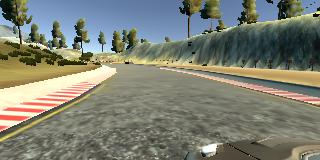
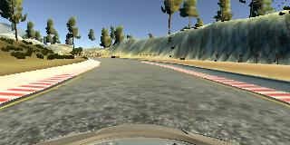
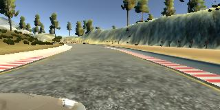
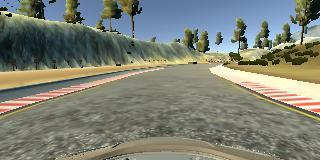

## Project 3 - Behavioral Cloning
### Project Goals
- Use the simulator to collect data of good driving behavior
- Build, a convolution neural network in Keras that predicts steering angles from images
- Train and validate the model with a training and validation set
- Test that the model successfully drives around track one without leaving the road
- Summarize the results with a written report

---

### Model Architecture

For this project, I initially rebuilt a LeNet style training model in Keras. Because this model was a computation rather than a classifier, it only had one output rather than several classes. The LeNet architecture was moderately successful in producing low-loss training and validation results, but ultimately did not train a model capable of driving the track.

The next architecture I tried was a clone of that used by Nvidia for self-driving cars. It was much more successful in driving the car, and ultimately was the model used for this submission. The model consisted of the following layers, and can be seen in the file "model.py" on lines 71 through 80.

| Layer         		    | Description	        					                          |
|-----------------------|---------------------------------------------------------|
| Input         		    | 90x295x3 normalized image (From preprocessing)				  |
| Convolution 1 	      | 5x5 filter, 24 output depth, Relu activation          	|
| Convolution 2 	      | 5x5 filter, 36 output depth, Relu activation          	|
| Convolution 3 	      | 5x5 filter, 48 output depth, Relu activation          	|
| Convolution 4 	      | 3x3 filter, 64 output depth, Relu activation          	|
| Convolution 1 	      | 3x3 filter, 64 output depth, Relu activation          	|
| Flatten 1             |                                                         |
| Fully Connected 1     | Outputs 100                                             |
| Fully Connected 2     | Outputs 50                                              |
| Fully Connected 3     | Outputs 10                                              |
| Fully Connected 4     | Outputs 1                                               |

### Data Overfitting

In this project, a model becoming overfit to the data could result in the car only being able to drive on one track, or else only being able to understand a single path through one of the tracks. In this way, if the car accidentally moved off course, it would not be able to recognize and make a decision based on input images that were not similar enough to images from the training set.

In order to combat this, 2 dropout layers were temporarily implemented in between the layers "Flatten 1", "Fully Connected 1", and "Fully Connected 2." The model was trained for 5 epochs, and surprisingly, the model performed much more poorly than before the dropout usages. The model was retrained with varying parameters including smaller and larger dropout rates (between 0.2 and 0.5), and more or fewer epochs (2 to 10). Even with different variations of the parameters, the model was unable to keep the car on the road.

Another, more successful strategy involved the use of a Python generator to send the training set in batches. This generator selected a random data point (images and steering angle), added in images from all 3 car cameras, and added horizontally flipped versions of the images with inverted steering angles.

For the outer left and right camera images, an angle offset was added or subtracted to indicate to the model that the car should steer harder if those images were recognized, as they would be farther away from the center of the car. The below images show a single capture from the left, center, and right cameras of the car, respectively.

The horizontally flipped images would allow the model to be trained on twice the data. An example of a regular and flipped image can be seen below.

Because the data set length was multiplied by 6 (3 cameras, inverted image for each), and the generator provided a quantity of images up to the original length of the set, not all images were used each epoch. This prevented images from becoming too familiar to the model.

Apart from training on randomly selected data, I reduced my number of epochs to 2. Higher values between 4 and 10 resulted in validation loss numbers that hovered around the same value, suggesting that they were "stepping over" the minimum loss.

### Parameter Tuning

The model used an "adam" optimizer, so the learning rate was not tuned manually (model.py, line 83).

The other parameters that were modified over the course of testing include the number of epochs, batch size, and outer camera angle offset. The tuning of the epoch quantity came as a natural step in training and prevention of model overfitting, and batch size was largely a matter of preference. The parameter that helped the model the most was the outer camera angle offset.

This value was the change in angle applied to the measurement associated with images from the left and right car images. In the instructional videos, the value 0.2 is used as a rough starting point, but I increased this value to 0.25. It was a subtle increase, but appeared to make a world of difference if the car veered toward the edge of the track. That extra angle allow a more severe turn back into the center of the track, and returned the car to the proper course more quickly.

### Training Data Capture

Capturing good data was the most critical portion of this project. Even if the training model is thorough, if the data put into it is poor or not representative of correct driving, the car will not drive autonomously on the road. As such, I practiced in the simulator for several laps, forward and backward in an effort to familiarize myself with the control scheme. In this way, I was able to capture 3 forward laps with very close to center lane driving, 1 backwards center lane lap, and fragments of a final lap of recovery data.

The backwards lap provided the model more context for autonomous driving. The road, ground, and side textures were the same, but from a different direction. This additional lap allowed my model to better predict steering angles regardless of track direction.

On the "recovery" fragments, I initiated recording while my vehicle was at the edge of the road, but with my tires already turned inward. I proceeded to the center of the road and corrected to center lane driving, then stopped the recording. These additional frames gave the model information on how to return to the center of the road if it veered off course.

This training set provided me with approximately 5000 points of data, including images from a left, right, and center camera, and the associated speed and steering angle.

The images from these data points were preprocessed by normalizing their pixel values to be between 0 and 1, and then adjusted to be 0 centered, with values ranging between -0.5 and 0.5 for simplicity. Next, the top 70 rows of pixels and the bottom 25 rows were cropped from the images. This removed the hood of the car from view, as well as the surrounding landscape. Having that additional image data in frame would only serve to "confuse" the model, as I was mostly concerned with the texture of the road and the road boundaries.

Finally, the data was shuffled randomly and 20% split off for a validation set. As mentioned before, the images were supplied to the model from a generator, and the generator handled the additional camera images and inversion.
